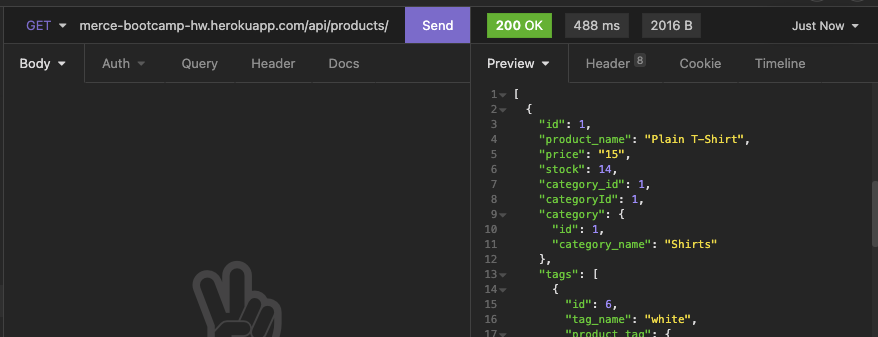
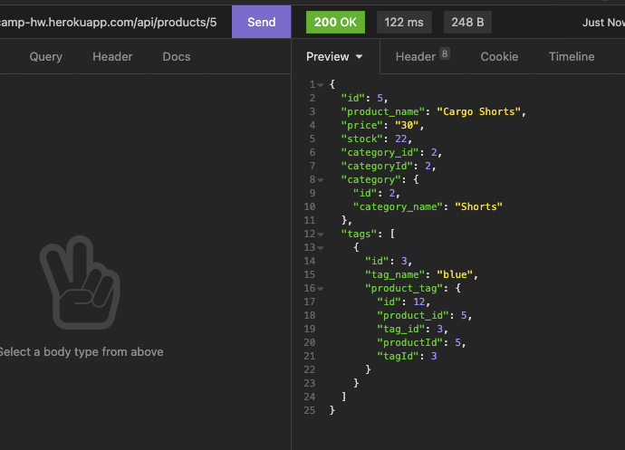
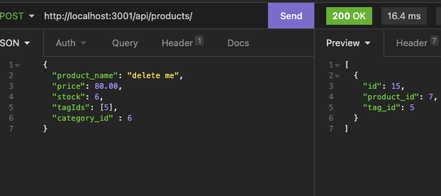
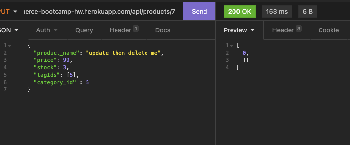
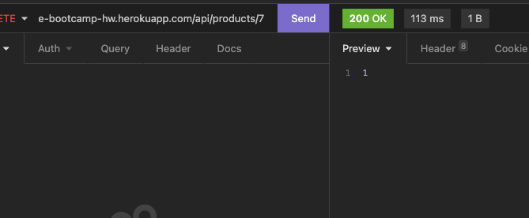
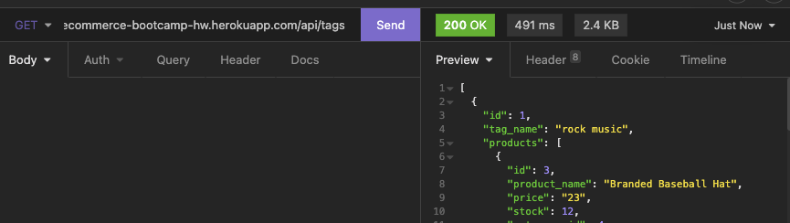
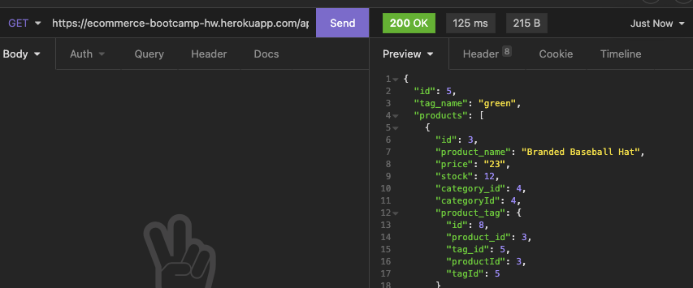
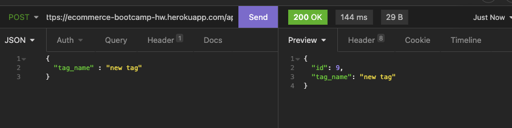
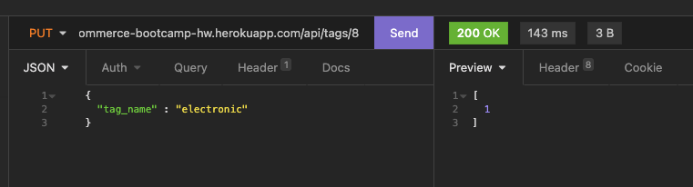
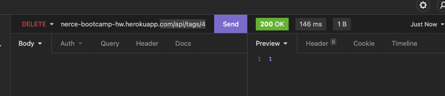

### About Ecommerce DB

Table of Contents

  <ol>
    <li><a href="#description">Description</a></li>
    <li><a href="#built-with">Built With</a></li>
    <li><a href="#installation">Installation</a></li>
    <li><a href="#usage">Usage</a></li>
    <li><a href="#future-updates">Future Updates</a></li>
  </ol>

## Description

This application uses a server to store e-commerce items and allows adding, updating, deleting, and viewing: categories, products, and tags.

## Built With

This application was built with MySQL2, Sequelize, dotenv, Express, and JavaScript. It was deployed through Heroku.

## Installation

Visit the link at https://ecommerce-bootcamp-hw.herokuapp.com. From there use an API like Insomnia to use requests to pull data.

## Usage

The base URL for our requests is https://ecommerce-bootcamp-hw.herokuapp.com. For instance,  using a GET request at with the end point /api/categories/ (with the full URL actually being https://ecommerce-bootcamp-hw.herokuapp.com/api/categories/) will show all categories in the database.

You can also view a specific category through a GET request by inputting it's id into the endpoint like so: /api/categories/5. Here we are viewing the category with the id 5.

Making a POST request with the endpoint api/categories/ allows you to create a category. Please select JSON as the body type and include an object formatted like so:

{
	"category_name" : "insert a tag here!"
}

An ID will automatically generate for this category. In the screenshot, 6 is the assigned value for this category's id.

You can update a category by specifying the ID at the end of the url. Here I am updating the category with the ID 5 to Summerwear.

The update is reflected when viewing all categories in the first get route.

You can also delete a category by id similar to the prior put request but as a delete method instead.

Here are the databases before with the new category included.

And then after.

The product routes are similar but with the endpoint /api/product. 

Viewing all products:

Viewing a product by ID:

Creating a product:

Updating a product by ID:

Deleting a product

The tags routes are similar but with the endpoint /api/tags. 

Viewing all tags:

Viewing a tag by ID:

Creating a tag:

Updating a tag by ID:

Deleting a tag

## Future Updates

<ul>
  <li>Add, remove, and update values within the tables</li>
</ul>
